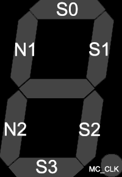

 

# What is this project about?

This is a fully self-contained physics simulation of a (relatively simple) system of interacting spins.

It implements the metropolis-Hastings monte carlo algorithm for 4 spins in a 1D [Ising model](https://en.wikipedia.org/wiki/Ising_model) (or Ising chain) with an external field and 2 "external" neighbours. The idea is that N of these circuits could be chained together to simulate a 1D Ising model with 4N spins.

My goal was to create a circuit that runs all steps of the Metropolis-Hastings algorithm, so no external lookup-tables or random numbers are needed. 
A clock input on pin 0 is necessary, the other 7 inputs are used to define the evironmental factors (temperature, coupling constants). The 7 segment display
is used to represent the state of the mini-Ising chain (including the external spins). The clock frequency is not really important, 10 clock cycles are needed to create the random number, so the actual MC step frequency is 1/10th of the input clock frequency.

  
This project started off in wokwi, as I have no experience with a HDL (or logic circuit design for that matter). Halfway through I realised it might have been better to use a HDL, but I was not sure I would make the deadline if I still had to learn verilog, so I managed to muscle through.

## Inputs
|Pin|Name|Function                                           |
|--|-----|---------------------------------------------------|
|0 |CLK  |Clock Input                                        |
|1 |T0   |LSB of the 3-bit temperature value                 |
|2 |T1   |Second bit of the temperature                      |
|3 |T2   |MSB of the 3-bit temperature value                 |
|4 |N1   |The value of neighbour 1 (up or down)              |
|5 |N2   |The value of neighbour 2 (up or down)              |
|6 |J    |The sign of the NN coupling constant J (+1 or -1)  |
|7 |H    |The value of the external field coupling H (1 or 0)|

## Outputs

|Pin|Name |Function                     |
|--|------|-----------------------------|
|0 |S0    |Status of spin 0             |
|1 |S1    |Status of spin 1             |
|2 |S2    |Status of spin 2             |
|3 |S3    |Status of spin 3             |
|4 |N2    |Status of neighbour 2        |
|5 |N1    |Status of neighbour 1        |
|6 |/     |                             |
|7 |MC_CLK|Indicates a MC step          |

## Ground States

When the temperature inputs are all set low, meaning at T=0K the system will eventually evolve into its ground state (i.e. the state with lowest energy).
For the system with 4 spins, no external field and the two external spins, four unqiue ground states can be identified, depending on N1, N2 and J.
Their representations and the corresponding input settings can be found in the following picture.

For other combinations of N1, N2 and J, there is no unique ground state and the system will never relax, even though it is at 0K.

## A note on units
Every physics simulation is useless if its units are not addressed.
* Temperature: Temperature is input as a 3-bit number (0-7), the unit of this input is 300K, so you can input between 0K and 2100K.
* Energy: Energy is expressed in units kT at room temperature, which can be approximated by 25meV.
* Nearest Neighbour coupling constant J: controlled by input 6, this coupling constants unit is that of energy.
* External field coupling constant H: controlled by input 7, this parameter is also in energy units.

## Chaining multiple units together
The goal of this project was to create a circuit that could be chained together to form a longer Ising chain. Bigger chains can be created by connecting the neighbour inputs N1 & N2 to the ouputs S0 and S3 of neighbouring units. In order to decrease correlations between different running circuits, it would be wise to either change the seed of the 32-bit LFSR or give each unit in the chain a different, random amount (several hundreds) of clock cycles before starting the simulation.

## Circuit Overview
The below image gives an overview of the main parts of the circuit and how they are connected.

### 32-bit LFSR
### Stage I: Calculating the energy change of the system
### Stage II: Calculating the acceptance rate of the spin-flip
### Other stuff

## What is Tiny Tapeout?

TinyTapeout is an educational project that aims to make it easier and cheaper than ever to get your digital designs manufactured on a real chip!

Go to https://tinytapeout.com for instructions!
